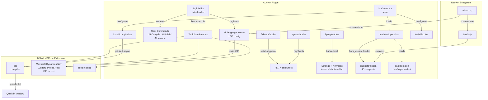
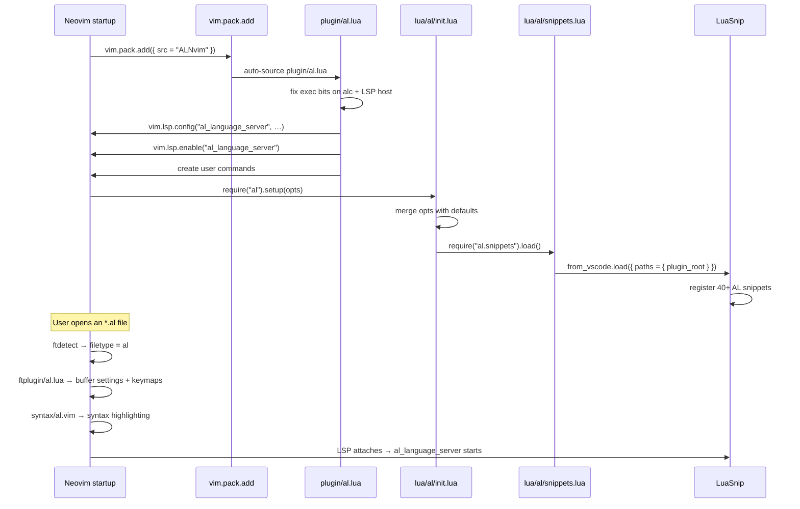
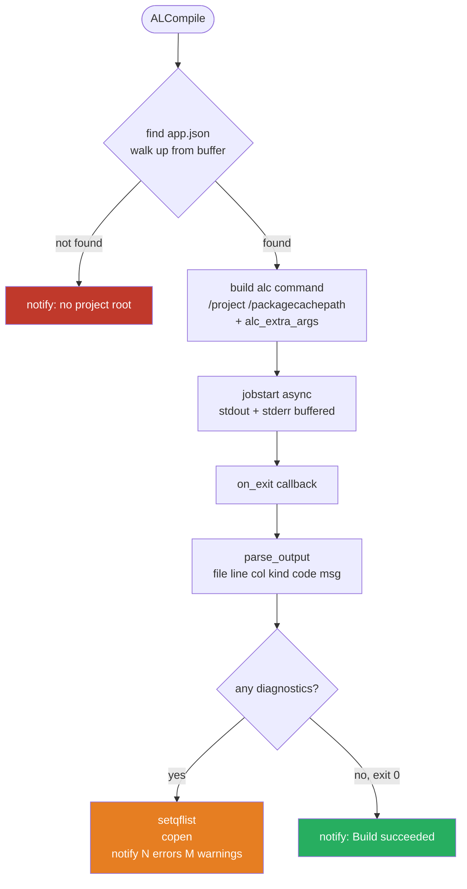
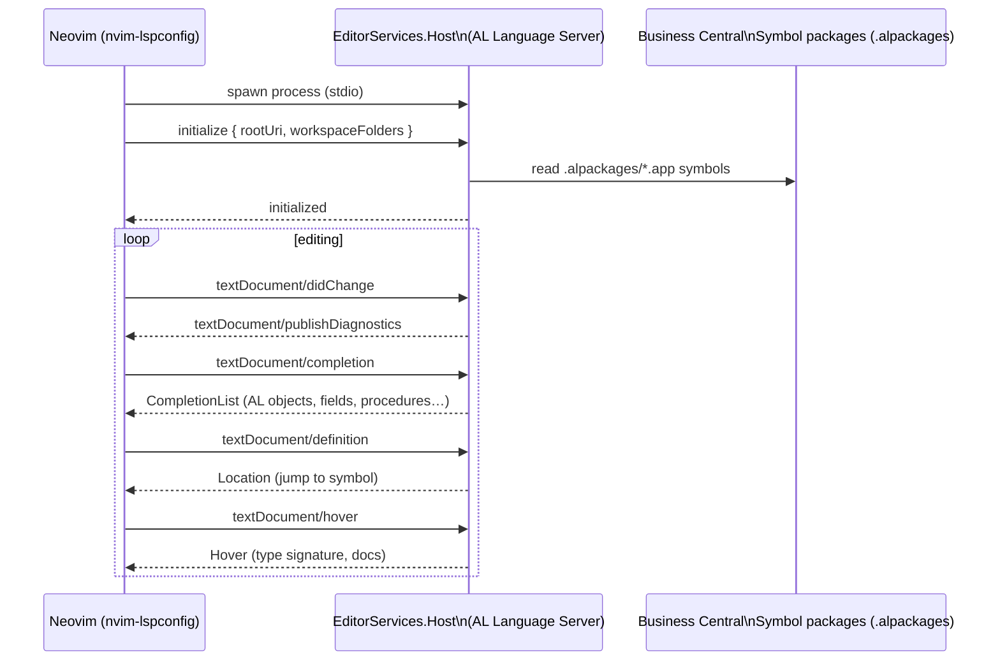
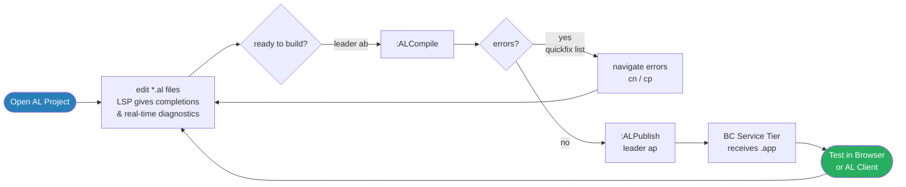
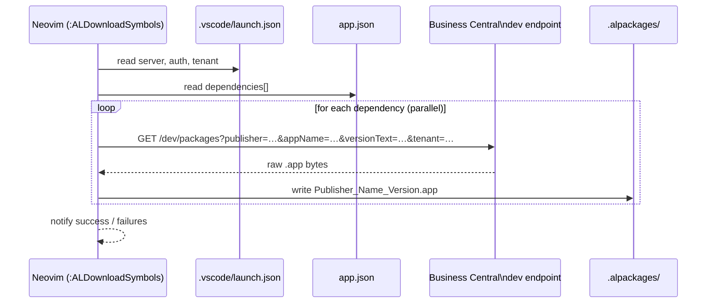
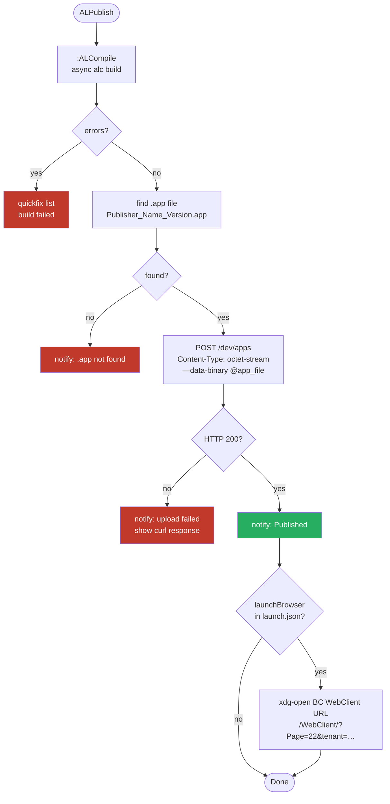
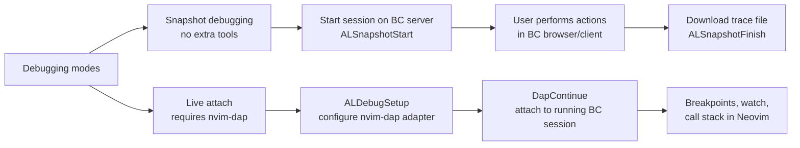
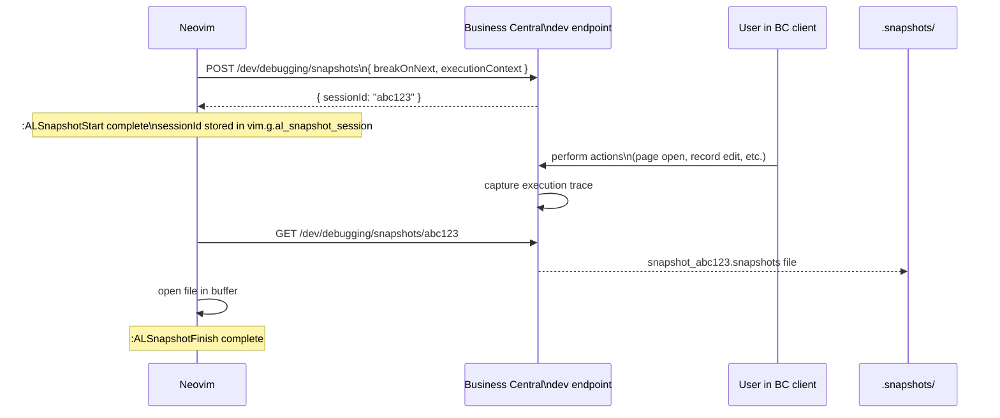
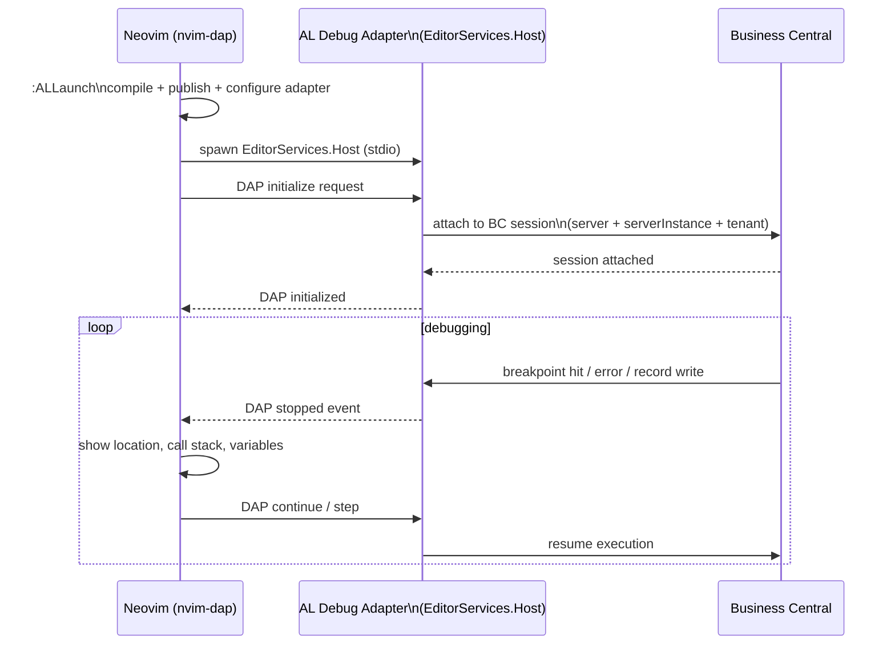

# ALNvim

Business Central AL language support for Neovim 0.11+, built on the Microsoft AL
language server that ships with the [AL VSCode extension](https://marketplace.visualstudio.com/items?itemName=ms-dynamics-smb.al).

Provides:
- Syntax highlighting derived from the official TextMate grammar
- Full LSP integration (completions, go-to-definition, hover, diagnostics, rename…)
- Code actions and quick fixes — quick fix, fix all, organise namespaces, refactor (convert `with`, promoted actions, implement interface)
- Async compilation with floating output window + quickfix list via the `alc` compiler
- One-step publish to Business Central (compile → POST `.app` to BC dev endpoint)
- Symbol package download from BC dev endpoint (all base + explicit dependencies)
- Snapshot debugging and live attach debugging via nvim-dap; optional nvim-dap-ui panels (scopes, stacks, watches, REPL)
- AL Help — open MS Learn AL docs and alguidelines.dev directly in the default browser
- AL Explorer — Telescope pickers for all AL objects across project + symbol packages, with live grep
- AL Object Wizard — interactive new-object creation with ID suggestion, extends picker, file naming
- Object ID completion — suggests next free IDs from `app.json` idRanges in insert mode
- Automatic file organiser — moves saved AL files to the correct `src/<type>/` folder on write
- 40+ LuaSnip snippets (object templates, control flow, events, HTTP, JSON)
- Two colour schemes: **bc_dark** (VS Code Business Central Dark) and **bc_yellow** (high-contrast black/yellow)
- Text objects — `daf`/`vif` for procedures/triggers, `daF`/`viF` for begin/end blocks
- Buffer-local keymaps and editor settings for AL files

---

## Requirements

**Required:**

| Requirement | Notes |
|---|---|
| Neovim ≥ 0.11 | Uses `vim.pack.add`, `vim.lsp.config`, `vim.uv` |
| MS AL VSCode extension | `~/.vscode/extensions/ms-dynamics-smb.al-*` (auto-detected) |
| [LuaSnip](https://github.com/L3MON4D3/LuaSnip) | For snippets |
| [nvim-cmp](https://github.com/hrsh7th/nvim-cmp) + [cmp_luasnip](https://github.com/saadparwaiz1/cmp_luasnip) | For completion |
| .NET runtime at `/usr/share/dotnet` | The AL language server is a .NET binary |

**Optional:**

| Requirement | Feature |
|---|---|
| [telescope.nvim](https://github.com/nvim-telescope/telescope.nvim) | AL Explorer, Procedure picker, Search |
| [nvim-dap](https://github.com/mfussenegger/nvim-dap) | Live attach debugging |
| [nvim-dap-ui](https://github.com/rcarriga/nvim-dap-ui) + [nvim-nio](https://github.com/nvim-neotest/nvim-nio) | Debug UI panels (scopes, stacks, watches, REPL) — auto-open on session start |
| `python3` (Linux/macOS) or `python` (Windows) | Report Layout Wizard — Excel (.xlsx) ZIP generation |

---

## Installation

Add to your `vim.pack.add` list **before** calling `require('al').setup()`:

```lua
vim.pack.add({
  { src = "/home/dav/Documents/ALNvim" },
  -- … your other plugins …
})

-- After LuaSnip is loaded:
require("al").setup()
```

### Configuration (all optional)

```lua
require("al").setup({
  -- Full path to the MS AL VSCode extension directory
  ext_path = vim.fn.expand("~/.vscode/extensions/ms-dynamics-smb.al-16.3.2065053"),

  -- Extra flags passed to alc on every compile
  alc_extra_args = {},
  -- Examples:
  -- alc_extra_args = { "/warnaserror+" },
  -- alc_extra_args = { "/analyzer:/path/to/AppSourceCop.dll" },

  -- Package cache path, relative to the project root
  packagecachepath = ".alpackages",

  -- Called when the AL language server attaches to a buffer
  on_attach = nil,
  -- Example:
  -- on_attach = function(client, bufnr)
  --   vim.keymap.set("n", "<leader>as", vim.lsp.buf.document_symbol, { buffer = bufnr })
  -- end,
})
```

---

## Architecture



---

## Plugin Load Sequence



---

## AL Help

`:ALHelp` (`<leader>ah`) opens MS Learn AL documentation directly in the default browser.
`:ALHelpTopics` (`<leader>aH`) shows a picker with 35 curated AL topics to open.
`:ALGuidelines` (`<leader>aG`) opens [alguidelines.dev](https://alguidelines.dev/).

`:ALHelp` accepts a full MS Learn URL or a bare `devenv-*` slug as an optional argument to
jump directly to a specific page.

---

## AL Explorer

Telescope-based pickers for navigating AL objects across the whole project and its
downloaded symbol packages.

| Command | Key | Description |
|---|---|---|
| `:ALExplorer` | `<leader>ae` | All AL objects: tables, pages, codeunits, enums… |
| `:ALExplorerProcs` | `<leader>af` | Procedures and triggers in the current file |
| `:ALSearch` | `<leader>ag` | Live grep across all AL files (project + symbols) |

Inside `:ALExplorer`, press `<C-s>` to cycle sort order (type → id → publisher → name)
and `<C-f>` to jump to live grep.

---

## AL Object Wizard

`:ALNewObject` (`<leader>an`) walks through a series of prompts to create a new AL object
file and open it for editing.

Supports 12 object types: Table, TableExtension, Page, PageExtension, Codeunit, Report,
Query, XmlPort, Enum, EnumExtension, Interface, PermissionSet.

- Object IDs are pre-filled with the next free ID from `app.json` `idRanges`
- Extension types offer a Telescope picker for the `extends` target
- Files are placed in `src/<type>/` following CRS naming conventions
- The **File Organiser** runs automatically on every `:w` — if an AL file is saved outside
  its correct `src/<type>/` folder, it is moved there transparently

---

## Report Layout Wizard

`:ALReportLayout` (`<leader>aw`) opens a multi-select picker for all three BC layout types.
A `rendering` section is automatically injected into the AL report source file. Excel files
are generated immediately; Word and RDLC layout files are created by `alc` on the next
`:ALCompile` (`<leader>ab`).

`:ALOpenLayout` (`<leader>aW`) searches for layout files (`.xlsx`, `.docx`, `.rdlc`) in
`<project root>/layouts/` and the AL file's own directory. One found → opens immediately;
multiple → picker.

### Layout types

| Format | Wizard action | Next step |
|---|---|---|
| Excel (`.xlsx`) | Generated immediately — one sheet per dataitem, column headers in row 1 | Ready to use as export layout in BC |
| Word (`.docx`) | Rendering entry added only — `alc` generates the file on `:ALCompile` | Open in BC → "Update and Export Layout" → edit with BC Word add-in |
| RDLC (`.rdlc`) | Rendering entry added only — `alc` generates the file on `:ALCompile` | Open in SSRS Report Builder or Visual Studio to style |

Excel uses Python 3's `zipfile` module to build the OOXML archive — no external `zip` tool
required. Word and RDLC are generated by `alc /generatereportlayout+` (enabled by default)
because they require BC's `DocumentFormat.OpenXml.dll` for correct XML controls and
`DataSet_Result` structure.

### AL source file wiring

After generating the selected layouts the wizard also modifies the report `.al` buffer
(without saving — review and `:w` manually):

```al
report 50100 "Sales Invoice"
{
    DefaultRenderingLayout = SalesInvoiceExcel;

    dataset { ... }

    rendering
    {
        layout(SalesInvoiceExcel)
        {
            Type = Excel;
            LayoutFile = 'layouts/SalesInvoiceExcel.xlsx';
        }
        layout(SalesInvoiceRDLC)
        {
            Type = RDLC;
            LayoutFile = 'layouts/SalesInvoiceRDLC.rdlc';
        }
    }
}
```

If a layout of the same type already exists in the rendering section, the wizard prompts
for a new name rather than overwriting the existing entry.

---

## Colour Schemes

ALNvim ships two colour schemes. Apply with `:colorscheme <name>` or via a live picker
(e.g. `Snacks.picker.colorschemes()`).

### bc_dark

Derived from the official VS Code **Business Central Dark** theme
(`themes/BC_dark.json` inside the AL extension).

| Token | Colour |
|---|---|
| Background | `#1E1E1E` |
| Foreground | `#D4D4D4` |
| Keywords / operators / control flow | `#00747F` teal |
| Types / object types (`codeunit`, `table`…) | `#4EC9B0` aqua |
| Functions | `#DCDCAA` yellow |
| Variables / identifiers | `#9CDCFE` light blue |
| Strings | `#CE9178` orange |
| Numbers | `#9FD89F` soft green |
| Language constants (`true` / `false`) | `#62CFD7` light teal |
| Comments | `#64707D` gray italic |
| Status bar | `#00747F` bg / `#FFFFFF` fg |

### bc_yellow

High-contrast dark theme with a near-black green background.

| Token | Colour |
|---|---|
| Background | `#010704` |
| Foreground | `#efefef` |
| Keywords / object types / built-in types | `#f6fa16` yellow |
| Comments | `#04b925` green |
| Strings / numbers / variables | `#efefef` near-white |

---

## Code Cops

`:ALSelectCops` (`<leader>ac`) opens a picker to choose which AL code analyzers run for
the current project. Changes apply immediately — no LSP restart required.

| Cop | Purpose |
|---|---|
| **CodeCop** | General AL coding guidelines |
| **PerTenantExtensionCop** | Per-tenant extension rules |
| **UICop** | UI / control add-in rules |
| **AppSourceCop** | AppSource submission rules — strict, opt-in only |

The default selection is CodeCop + PerTenantExtensionCop + UICop. AppSourceCop is off by
default because it enforces AppSource-specific requirements (tooltips on all fields,
event publisher rules, etc.) that are not relevant for internal or per-tenant extensions.

The selection is saved to `.vscode/alnvim.json` in the project root and read on every
LSP attach, so it persists across Neovim sessions.

Diagnostics from the active cops appear inline in the buffer. Use:
- `<leader>ad` — Telescope list of all diagnostics for the current buffer
- `<leader>D` — floating detail for the diagnostic on the current line
- `]d` / `[d` — jump to next / previous diagnostic

---

## Code Actions

All AL code actions are delivered through the standard LSP `textDocument/codeAction`
protocol — no custom AL protocol is required. Actions appear when the language server
has indexed the project (after the `AL: project loaded` notification).

| Key | Scope | What it does |
|---|---|---|
| `<leader>ca` | cursor | All code actions (global LspAttach binding) |
| `<leader>aca` | cursor | All code actions — AL buffer-scoped |
| `<leader>acf` | cursor line | Quick fixes for the diagnostic(s) under the cursor |
| `<leader>acF` | file | **Fix all** — apply every `source.fixAll` action in the file at once |
| `<leader>acn` | file | **Organise namespaces** — add missing `using` statements and sort them |
| `<leader>acr` | cursor | **Refactor** — convert `with` statements, convert promoted actions to modern action bar, implement interface members |

### Available refactor actions (from the AL language server)

| Action | Trigger |
|---|---|
| Convert explicit `with` statement to fully qualified references | `refactor` on `with` block |
| Convert promoted actions to modern action bar syntax | `refactor` on promoted action |
| Implement interface members | `quickfix` on unimplemented interface |
| Move tooltips from page controls to table fields | `quickfix` on tooltip diagnostic |
| Fix application area duplicates / set defaults | `quickfix` on AA diagnostics |
| Convert event subscriber syntax | `refactor` on event subscriber |
| Fix AL0604 / AL0606 / AL0729 warnings | `source.fixAll` or `quickfix` |

---

## Compilation Workflow

`:ALCompile` (or `<leader>ab`) runs the `alc` compiler asynchronously. Errors and warnings
are parsed into the Neovim quickfix list so you can navigate them with standard commands
(`:cn`, `:cp`, `:copen`).



### alc output format

```
/path/to/File.al(12,5): error AL0428: The name 'MyVar' does not exist.
/path/to/File.al(8,1):  warning AL0432: Consider using 'var' keyword.
```

Each line maps to one quickfix entry with filename, line, column, type (`E`/`W`), and the `ALxxxx` code + message.

---

## LSP Integration

The AL language server (`Microsoft.Dynamics.Nav.EditorServices.Host`) ships inside the
VSCode extension and communicates over **stdio** using the standard Language Server Protocol.
ALNvim registers it as a named config so it coexists cleanly with your other LSP servers.



### LSP keymaps (from your init.lua LspAttach autocmd)

These apply to all LSP servers including AL:

| Key | Action |
|---|---|
| `K` | Hover / signature help |
| `gd` | Go to definition |
| `gr` | Show references |
| `gi` | Go to implementation |
| `<leader>rn` | Rename symbol |
| `<leader>ca` | All code actions |
| `<leader>D` | Open diagnostic float |
| `[d` / `]d` | Previous / next diagnostic |
| `<leader>lf` | Format document |

### AL-specific code action keymaps (AL buffers only)

| Key | Action |
|---|---|
| `<leader>aca` | All code actions |
| `<leader>acf` | Quick fixes for diagnostic on cursor line |
| `<leader>acF` | Fix all (`source.fixAll`) — bulk-fix all auto-fixable issues in the file |
| `<leader>acn` | Organise namespaces / using statements (`source.organizeImports`) |
| `<leader>acr` | Refactor actions (convert `with`, promoted actions, implement interface…) |

---

## AL Development Workflow



---

## Snippets

Snippets are loaded from `snippets/al.json` via LuaSnip's VSCode-format loader.
Type the prefix and press `<Tab>` to expand. Use `<Tab>` / `<S-Tab>` to jump between placeholders.

### Object templates

| Prefix | Expands to |
|---|---|
| `ttable` | Full table with fields, keys, DataClassification |
| `ttableext` | Table extension with field |
| `tpage` | Page with layout, area, group, actions |
| `tpageext` | Page extension with addlast |
| `tcodeunit` | Codeunit with OnRun trigger |
| `treport` | Report with dataset, dataitem, requestpage |
| `tquery` | Query with elements and dataitem |
| `tenum` | Enum with two values |
| `tenumext` | Enum extension |
| `tinterface` | Interface with one procedure |

### Control flow

| Prefix | Expands to |
|---|---|
| `tif` | `if … then begin … end;` |
| `tifelse` | `if … then begin … end else begin … end;` |
| `tcaseof` | `case … of … end;` |
| `tcaseelse` | `case … of … else … end;` |
| `tfor` | `for … := … to … do begin … end;` |
| `tforeach` | `foreach … in … do begin … end;` |
| `twhile` | `while … do begin … end;` |
| `trepeat` | `repeat … until …;` |
| `tfindset` | `if Rec.FindSet() then repeat … until Rec.Next() = 0;` |

### Procedures, triggers & events

| Prefix | Expands to |
|---|---|
| `tprocedure` | Procedure with var block |
| `ttrigger` | Trigger skeleton |
| `tonaftergetrecord` | `OnAfterGetRecord` trigger |
| `toninsert` / `tonmodify` / `tondelete` | Table write triggers |
| `tonvalidate` | `OnValidate` field trigger |
| `teventsub` | `[EventSubscriber(…)]` + procedure |
| `teventint` | `[IntegrationEvent(…)]` |
| `teventbus` | `[BusinessEvent(…)]` |
| `teventinternal` | `[InternalEvent(…)]` |
| `teventexternal` | `[ExternalBusinessEvent(…)]` |

### Utility

| Prefix | Expands to |
|---|---|
| `tfield` | Table field definition |
| `tpagefield` | Page field with ToolTip |
| `tsetrange` | `SetRange(Field, From, To)` |
| `terror` | `error('… %1', Var)` |
| `tmessage` | `Message('… %1', Var)` |
| `tconfirm` | `if not Confirm(…) then exit;` |
| `thttpclient` | Full HttpClient GET skeleton |
| `tjsonparse` | JsonObject.ReadFrom + Get + AsValue |

---

## User Commands Reference

### Build & Publish

| Command | Key | Description |
|---|---|---|
| `:ALCompile [dir]` | `<leader>ab` | Compile with `alc`; floating output + errors → quickfix |
| `:ALPublish [dir]` | `<leader>ap` | Compile then publish `.app` to BC |
| `:ALPublishOnly [dir]` | `<leader>aP` | Publish existing `.app` (skip compile) |
| `:ALDownloadSymbols [dir]` | `<leader>as` | Download symbol packages from BC |

### Navigation & Help

| Command | Key | Description |
|---|---|---|
| `:ALHelp [url\|slug]` | `<leader>ah` | Open AL docs in browser (MS Learn) |
| `:ALHelpTopics` | `<leader>aH` | Open AL Help topic picker |
| `:ALGuidelines` | `<leader>aG` | Open alguidelines.dev in browser |
| `:ALExplorer [dir]` | `<leader>ae` | Telescope: browse all AL objects (project + symbols) |
| `:ALExplorerProcs` | `<leader>af` | Telescope: browse procedures in current file |
| `:ALSearch [dir]` | `<leader>ag` | Live grep across all AL files |
| `:ALNextId` | — | Show next free object ID for type on current line |

### Object Creation & Layouts

| Command | Key | Description |
|---|---|---|
| `:ALNewObject [dir]` | `<leader>an` | Interactive wizard to create a new AL object file |
| `:ALReportLayout` | `<leader>aw` | Generate Excel (.xlsx) and/or add rendering entries for Word/RDLC layouts (Word/RDLC generated by alc on `:ALCompile`) |
| `:ALOpenLayout` | `<leader>aW` | Open existing report layout file in the default app |

### Debugging

| Command | Key | Description |
|---|---|---|
| `:ALLaunch [dir]` | `<F5>` / `<leader>adl` | Compile, publish then attach debugger (`<F5>` continues if a session is already active) |
| `:ALSnapshotStart` | `<leader>ads` | Start BC snapshot debugging session |
| `:ALSnapshotFinish` | `<leader>adf` | Finish snapshot and download file |
| `:ALDebugSetup` | `<leader>add` | Configure nvim-dap adapter without compiling |
| — | `<F9>` | Toggle breakpoint |
| — | `<F11>` | Step into |
| — | `<F12>` | Step over |
| — | `<leader>du` | Toggle nvim-dap-ui panels |
| — | `<leader>dw` | Evaluate word under cursor |
| — | `<leader>de` | Evaluate expression / selection |

### Project

| Command | Key | Description |
|---|---|---|
| `:ALOpenAppJson` | `<leader>ao` | Open `app.json` for current project |
| `:ALOpenLaunchJson` | `<leader>al` | Open `.vscode/launch.json` |
| `:ALSelectCops` | `<leader>ac` | Pick active code cops for this project |
| `:ALClearCredentials` | — | Clear cached BC credentials |
| `:ALReloadSnippets` | — | Reload snippets from `snippets/al.json` |
| `:ALInfo` | — | Show extension path, LSP binary, project manifest |

### Diagnostics

| Command | Key | Description |
|---|---|---|
| — | `<leader>aq` | Open quickfix list (compiler errors/warnings) |
| — | `<leader>ad` | Buffer diagnostics list (Telescope picker or location list) |
| — | `<leader>D` | Diagnostic float for current line |
| — | `]d` / `[d` | Jump to next / previous diagnostic |

---

## AL Project Structure

ALNvim detects the project root as the nearest directory containing `app.json`. A typical AL project looks like:

```
MyProject/
├── app.json                  ← manifest: publisher, name, version, dependencies
├── .alpackages/              ← symbol packages downloaded from BC (*.app)
├── .vscode/
│   └── launch.json           ← BC server connection (serverInstance, authentication…)
└── src/
    ├── Tables/
    │   └── MyTable.Table.al
    ├── Pages/
    │   └── MyPage.Page.al
    └── Codeunits/
        └── MyCodeunit.Codeunit.al
```

### Minimal `app.json`

```json
{
  "id": "xxxxxxxx-xxxx-xxxx-xxxx-xxxxxxxxxxxx",
  "name": "My Extension",
  "publisher": "My Company",
  "version": "1.0.0.0",
  "brief": "",
  "description": "",
  "privacyStatement": "",
  "EULA": "",
  "help": "",
  "url": "",
  "logo": "",
  "dependencies": [],
  "screenshots": [],
  "platform": "24.0.0.0",
  "application": "24.0.0.0",
  "runtime": "13.0",
  "target": "Cloud",
  "idRanges": [{ "from": 50000, "to": 50099 }]
}
```

### Minimal `.vscode/launch.json`

```json
{
  "version": "0.2.0",
  "configurations": [
    {
      "name": "Publish to BC",
      "type": "al",
      "request": "launch",
      "environmentType": "OnPrem",
      "server": "http://localhost",
      "serverInstance": "BC",
      "authentication": "Windows",
      "startupObjectId": 22,
      "startupObjectType": "Page",
      "breakOnError": "All",
      "launchBrowser": true,
      "enableLongRunningSqlStatements": true,
      "enableSqlInformationDebugger": true
    }
  ]
}
```

---

## Downloading Symbols

AL completions and diagnostics require symbol packages (`.app` files) in `.alpackages/`.
Run `:ALDownloadSymbols` (or `<leader>as`) to fetch them directly from your BC instance.

### How it works



All downloads run in parallel. A failed download is reported by name; partial files are removed automatically.

### Authentication

Authentication type is read from `launch.json → authentication`:

| Type | How credentials are resolved |
|---|---|
| `Windows` | Current user's Kerberos/NTLM ticket (`curl --ntlm --negotiate -u :`) |
| `UserPassword` / `NavUserPassword` | `al_username`/`al_password` in launch.json, or `AL_BC_USERNAME`/`AL_BC_PASSWORD` env vars, or interactive prompt |
| `AAD` / `MicrosoftEntraID` | Bearer token from `AL_BC_TOKEN` env var, or interactive prompt |

For non-interactive use (CI), set `AL_BC_USERNAME` and `AL_BC_PASSWORD` (or `AL_BC_TOKEN`) as environment variables.

---

## Publishing to Business Central

`:ALPublish` (or `<leader>ap`) compiles the project and, if there are no errors, uploads
the resulting `.app` to the BC dev endpoint. Use `:ALPublishOnly` (`<leader>aP`) to skip
the compile step and re-upload the last built `.app`.

### Publish workflow



### Schema update modes

The `schemaUpdateMode` from `launch.json` is forwarded to BC:

| Value | Behaviour |
|---|---|
| `synchronize` | BC synchronises table schema changes automatically (default) |
| `recreate` | Drops and recreates tables (destructive – use with care) |
| `forcesync` | Forces synchronise even when data would be lost |

### Cloud / sandbox environments

For cloud environments (`environmentType: Sandbox` or `Production`) the base URL is
automatically rewritten to:
```
https://api.businesscentral.dynamics.com/v2.0/<tenant>/<environmentName>
```

---

## Debugging

ALNvim supports two debugging modes.



### Snapshot debugging

Snapshot debugging captures a full server-side execution trace without requiring a
persistent debugger connection. It works on both on-prem and cloud BC.



**Workflow:**
1. Open an AL file in the project
2. `:ALSnapshotStart` (or `<leader>ads`) — BC registers the session and waits
3. Perform the actions you want to trace in the BC browser / Windows client
4. `:ALSnapshotFinish` (or `<leader>adf`) — downloads the `.snapshots` file to `.snapshots/`
5. Open the file to inspect the trace (or use the AL VSCode extension's snapshot viewer)

The `breakOnNext` and `executionContext` values are read from `launch.json`. Default is
`WebClient` / `DebugAndProfile`.

### Live attach with nvim-dap

Live attach suspends execution at breakpoints in real time. It requires
[nvim-dap](https://github.com/mfussenegger/nvim-dap).



**Setup:**
1. Add nvim-dap (and optionally nvim-dap-ui + nvim-nio) to `vim.pack.add`:
   ```lua
   { src = "https://github.com/mfussenegger/nvim-dap" },
   { src = "https://github.com/rcarriga/nvim-dap-ui" },
   { src = "https://github.com/nvim-neotest/nvim-nio" },
   ```
2. Press `<F5>` on an AL file (or `:ALLaunch`) — compiles, publishes, and attaches the debugger
3. Perform actions in BC; breakpoints set with `<F9>` will fire
4. nvim-dap-ui panels open automatically when the session starts and close when it ends

### Debug keymaps (AL buffers)

| Key | Action |
|---|---|
| `<F5>` | If session active: **continue**; otherwise: **ALLaunch** (compile + publish + attach) |
| `<F9>` | Toggle breakpoint |
| `<F11>` | Step into |
| `<F12>` | Step over |
| `<leader>adl` | `:ALLaunch` — compile, publish and attach |
| `<leader>ads` | `:ALSnapshotStart` |
| `<leader>adf` | `:ALSnapshotFinish` |
| `<leader>add` | `:ALDebugSetup` — configure adapter only (no compile) |
| `<leader>adb` | Toggle breakpoint |
| `<leader>adB` | Conditional breakpoint |
| `<leader>adc` | Continue |
| `<leader>adq` | Terminate session |
| `<leader>adi` | Inspect variable under cursor (hover float) |

### nvim-dap-ui panels

When nvim-dap-ui is installed the debug UI opens automatically on session start:

| Panel | Position | Contents |
|---|---|---|
| Scopes | Left sidebar (top 40%) | Local and global variables at the current stack frame |
| Watches | Left sidebar (20%) | Pinned expressions — updated at every step |
| Stacks | Left sidebar (25%) | Call stack / stack trace |
| Breakpoints | Left sidebar (15%) | All set breakpoints |
| REPL | Right sidebar (top 70%) | Interactive expression evaluator — type any AL expression and press `<CR>` |
| Console | Right sidebar (30%) | Adapter output (read-only) |

Additional keymaps (configured in your `init.lua`):

| Key | Action |
|---|---|
| `<leader>du` | Toggle dap-ui open/closed |
| `<leader>de` | Evaluate expression (prompt) or selected text in a float |
| `<leader>dw` | Evaluate the word under the cursor instantly |

### Adapter output window

The AL adapter emits structured output (publish status, session info, errors) as DAP
`output` events. ALNvim displays these in a **floating window** positioned in the top-right
corner of the editor (`q` to close). It reopens automatically when new output arrives.

### Variable inspection

The AL debug adapter (`EditorServices.Host`) does not implement the DAP `scopes`/`variables`
protocol, so the Scopes panel will be empty. Use the **REPL** panel or `<leader>dw` / `<leader>de`
to inspect values — both use the `evaluate` request which the AL adapter does support.

> **Note:** `:ALLaunch` is the recommended entry point. It compiles with `alc`, publishes
> to BC, then attaches the debug adapter in one step. For on-prem `UserPassword`
> environments, `:ALLaunch` works on Linux; on Windows on-prem it may fail with an
> internal adapter error (known limitation — use cloud sandboxes or VSCode for on-prem
> Windows debugging).

---

## Troubleshooting

### LSP does not attach

1. Run `:ALInfo` — confirms binary path and project root detection.
2. Run `:checkhealth lsp` — lists active clients and any errors.
3. Run `:lua vim.lsp.get_clients()` — check `al_language_server` appears.
4. The AL server requires `app.json` in the project root. Open a file *inside* the project directory.
5. The server needs `.NET` at `/usr/share/dotnet`. Your `init.lua` already sets `DOTNET_ROOT`.

### No completions from LSP

Symbols come from the `.alpackages/` directory. Run `:ALDownloadSymbols` to fetch them, or place the `.app` symbol files manually.

### Compilation errors not showing

Run `:ALCompile` with `:copen` manually. If `alc` is not found, run `:ALInfo` to verify
the extension path. If you see a permissions error, restart Neovim (exec bits are fixed at startup).

### Snippets not expanding

Ensure `require("al").setup()` is called **after** LuaSnip is loaded. Run `:ALReloadSnippets` to force a reload. Check `:lua require("luasnip").get_snippets("al")` returns entries.

---

### Download Symbols fails

- Confirm the server URL in `launch.json` is reachable: `curl -v http://<server>/<instance>/dev/packages`
- For `Windows` auth on Linux, ensure `krb5-user` is installed and `kinit` has a valid ticket, or switch to `UserPassword` auth in `launch.json`
- Set `AL_BC_USERNAME` / `AL_BC_PASSWORD` env vars to avoid interactive prompts

### Publish fails

- Confirm the compiled `.app` exists in the project root (`ls *.app`)
- Check the BC service tier log for schema conflict errors
- Try changing `schemaUpdateMode` in `launch.json` from `synchronize` to `forcesync`

### Snapshot session not starting

- Snapshot debugging requires BC version 17.0+
- The BC user must have the `D365 SNAPSHOT DEBUG` permission set
- Run `:ALInfo` to confirm the server URL is correct

### nvim-dap adapter not connecting

- Run `:DapLog` immediately after `:DapContinue` to see the raw DAP exchange
- The `EditorServices.Host` binary may need additional initialization options not yet documented; raising an issue is helpful

---

