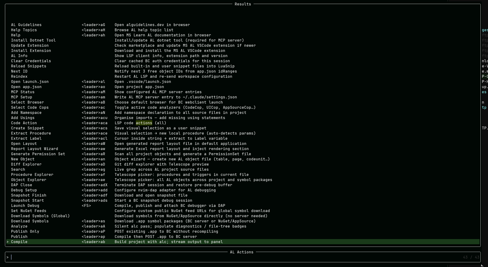
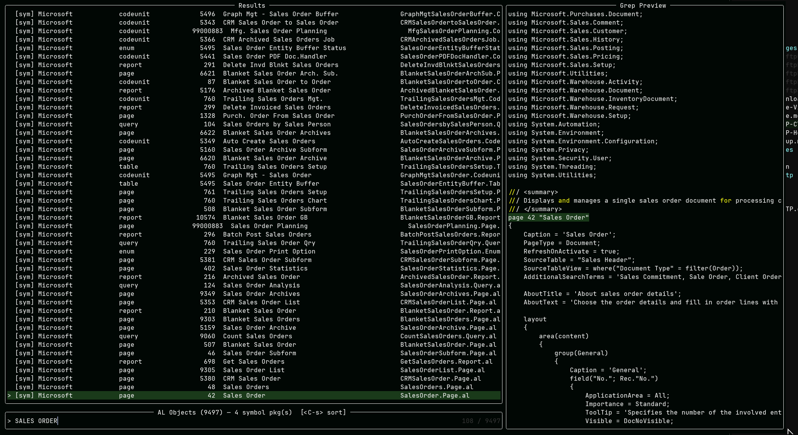
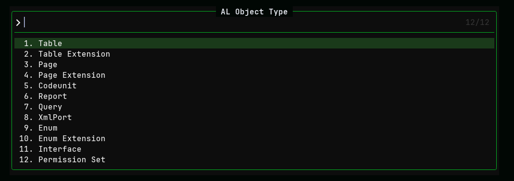
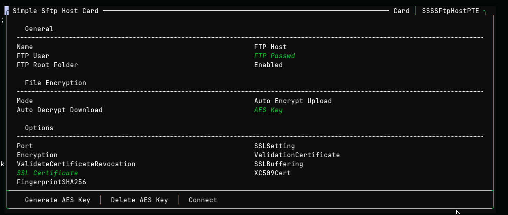
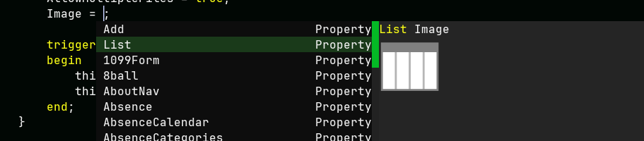
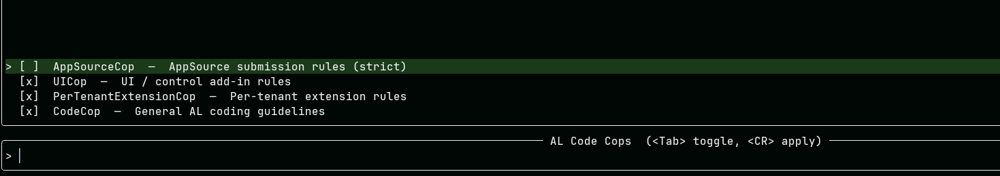
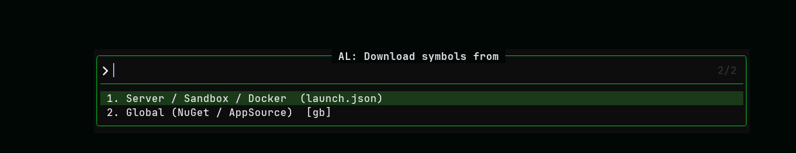
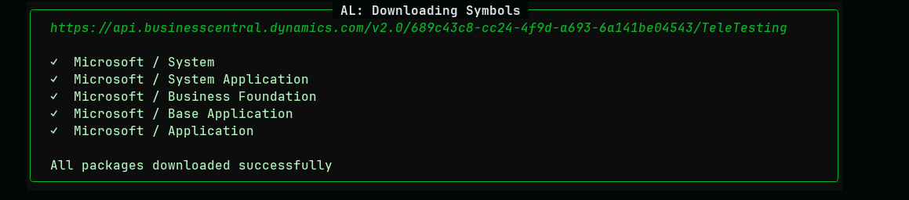
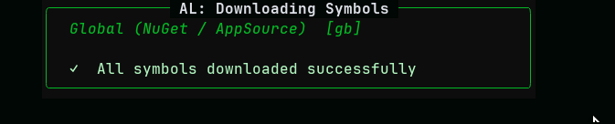

# ALNvim

Business Central AL language support for Neovim 0.11+, built on the Microsoft AL
language server that ships with the [AL VSCode extension](https://marketplace.visualstudio.com/items?itemName=ms-dynamics-smb.al).

## Features

- Syntax highlighting derived from the official TextMate grammar
- Full LSP integration — completions, go-to-definition, hover, diagnostics, rename, format on save
- Code actions and quick fixes — quick fix, fix all, organise namespaces, refactor
- Async compilation via `alc` with floating output panel and quickfix list
- One-step publish to Business Central (compile → POST `.app` to BC dev endpoint)
- Symbol package download from BC dev endpoint (all base + explicit dependencies)
- Snapshot debugging and live attach debugging via nvim-dap + optional nvim-dap-ui panels
- **AL MCP Server** — wires the Microsoft AL Development Tools MCP server into Claude Code so Claude can build, publish, search symbols, and debug BC from AI chat
- AL Explorer — Telescope pickers for all objects across project + symbol packages, with live grep
- AL Object Wizard — interactive new-object creation with ID suggestion and file organiser
- Report Layout Wizard — generate Excel/Word/RDLC layouts from AL report datasets
- Object ID completion from `app.json` idRanges in insert mode
- 40+ LuaSnip snippets — object templates, control flow, events, HTTP, JSON
- Two colour schemes: **bc_dark** (VS Code Business Central Dark) and **bc_yellow** (high-contrast)
- Text objects for procedures/triggers and begin/end blocks

## Screenshots

**AL Actions** — searchable picker for all 40+ commands with descriptions and keymaps



**AL Explorer** — Telescope object browser across project source and downloaded symbol packages, with live preview



**AL Object Wizard** — interactive new-object creation with all 12 AL object types



**Go-to-definition** — `gd` fetches `al-preview://` source and renders it in a read-only scratch buffer



**LSP completions** — property value completions with type information



**Code Cops** — toggle analyzers live without restarting the language server



**Download Symbols** — choose between server/sandbox/Docker (launch.json) or global NuGet/AppSource







## Quick start

```lua
vim.pack.add({
  { src = "/path/to/ALNvim" },
}, { load = true })

require("al").setup()
```

See the **[Installation wiki page](https://github.com/drs76/ALNvim/wiki/Installation)**
for requirements, all configuration options, and how to install the MS AL extension
without VS Code.

## Documentation

Full documentation is in the [wiki](https://github.com/drs76/ALNvim/wiki):

| Page | Contents |
|---|---|
| [Installation](https://github.com/drs76/ALNvim/wiki/Installation) | Requirements, setup, all config options |
| [Architecture](https://github.com/drs76/ALNvim/wiki/Architecture) | Plugin structure, load sequence diagrams |
| [LSP Integration](https://github.com/drs76/ALNvim/wiki/LSP-Integration) | Language server, keymaps, format on save, project root detection |
| [Compilation](https://github.com/drs76/ALNvim/wiki/Compilation) | alc compiler, output panel, quickfix, rulesets |
| [Downloading Symbols](https://github.com/drs76/ALNvim/wiki/Downloading-Symbols) | Fetching .app symbol packages, authentication |
| [Publishing](https://github.com/drs76/ALNvim/wiki/Publishing) | Compile → publish workflow, schema modes, cloud vs on-prem |
| [Debugging](https://github.com/drs76/ALNvim/wiki/Debugging) | Snapshot debugging, live attach, nvim-dap-ui panels, variable inspection |
| [AL MCP Server](https://github.com/drs76/ALNvim/wiki/AL-MCP-Server) | Claude Code integration via Microsoft AL Development Tools |
| [AL Explorer](https://github.com/drs76/ALNvim/wiki/AL-Explorer) | Object browser, procedure picker, live grep, AL Help, Git diff |
| [AL Object Wizard](https://github.com/drs76/ALNvim/wiki/AL-Object-Wizard) | New-object creation, file organiser, ID completion |
| [Report Layout Wizard](https://github.com/drs76/ALNvim/wiki/Report-Layout-Wizard) | Excel/Word/RDLC layout generation |
| [Code Actions and Cops](https://github.com/drs76/ALNvim/wiki/Code-Actions-and-Cops) | Quick fixes, refactors, code analyzers, browser selection |
| [Snippets](https://github.com/drs76/ALNvim/wiki/Snippets) | 40+ LuaSnip snippets reference |
| [Colour Schemes](https://github.com/drs76/ALNvim/wiki/Colour-Schemes) | bc_dark and bc_yellow |
| [Commands Reference](https://github.com/drs76/ALNvim/wiki/Commands-Reference) | All user commands and keymaps |
| [Project Structure](https://github.com/drs76/ALNvim/wiki/Project-Structure) | app.json, launch.json, alnvim.json examples |
| [Troubleshooting](https://github.com/drs76/ALNvim/wiki/Troubleshooting) | Common problems and fixes |
